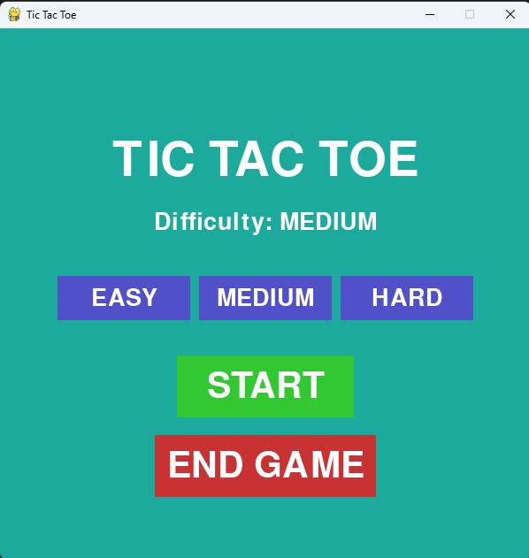
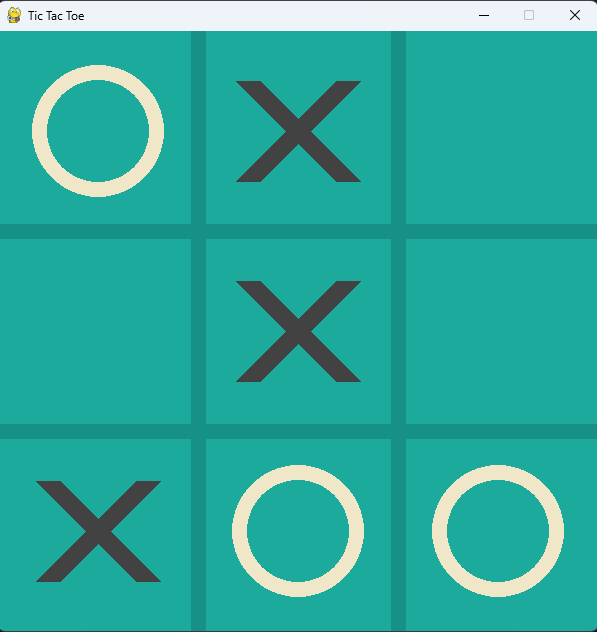
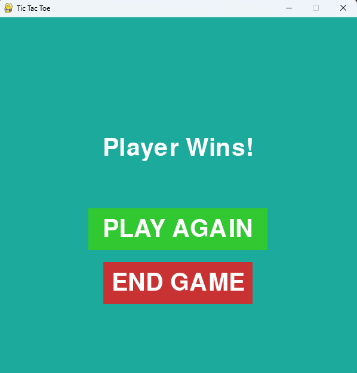
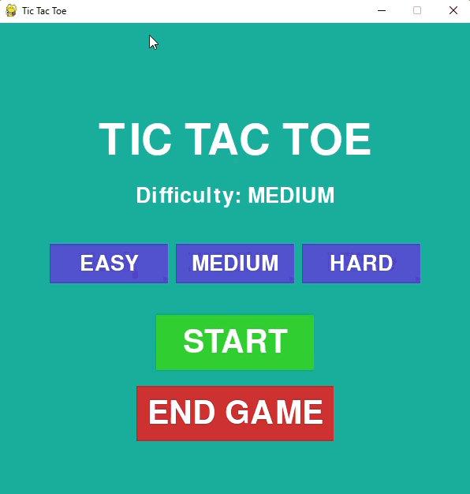

<div align="center">
  
# ❌ Tic Tac Toe - Minimax AI ⭕

A Python + Pygame desktop Tic Tac Toe game with a clean UI, click sound effects, adjustable difficulty, and an unbeatable AI opponent built on the Minimax algorithm.

<p align="center">
  


</p>

</div>

---

## 📖 Overview

**Tic Tac Toe - Minimax AI** is a fully playable desktop implementation of the classic X and O game. The player goes up against an AI that uses the **Minimax algorithm** to evaluate every possible game state and make the optimal move; meaning it never loses. A random-move easy mode is also available for casual play. Built entirely with `pygame` and `numpy`, no external game engine required.

---

## 🖼️ Screenshots

<p align="center">
  
  
  
</p>

> _The game board mid-match - player X vs. the Minimax AI_

---

## 🎥 Gameplay Preview

<p align="center">
  
</p>

> _Easy mode (Minimax AI) gameplay preview_

---


## ✨ Features

- 🧠 **Unbeatable AI** powered by the Minimax algorithm
- 🎚️ **Three difficulty levels**: Easy (random), Medium, and Hard (Minimax)
- 🎨 **Clean real-time GUI**: Xs and Os drawn live on a smooth board
- 🔊 **Click sound effects** via `click_sound.wav`
- 🔄 **Instant restart**: press `R` at any time to reset the board
- 🪶 **Lightweight**: no game engine, just pure Python

---

## 🛠️ Tech Stack

| Tool | Purpose |
|------|---------|
| `Python 3` | Core language |
| `pygame` | Game window, drawing, events, sound |
| `numpy` | Board state representation |

---

## ⚙️ Requirements

- Python 3.7+
- `pygame`
- `numpy`

---

## 🚀 Getting Started

**1. Clone the repository**
```bash
git clone https://github.com/MusaIslamFahad/tic-tac-toe-minimax.git
cd tic-tac-toe-minimax
```

**2. Install dependencies**
```bash
pip install pygame numpy
```

**3. Run the game**
```bash
python "Tic_Tac_Toc Game/main.py"
```

> Make sure `click_sound.wav` is in the same directory as the script for sound effects to work.

---

## 🕹️ How to Play

| Action | Control |
|--------|---------|
| Place your move | Click on any empty square |
| Restart the game | Press `R` |
| Quit | Close the window |

- You play as **X**, the AI plays as **O**
- On **Hard** mode, the AI uses Minimax; it will never lose
- On **Easy** mode, the AI picks random empty squares; great for beginners

---

## 🤖 How the AI Works

The AI uses the **Minimax algorithm**, a classic decision-making technique in game theory:

1. It recursively simulates all possible future moves for both players
2. It assigns a score to each terminal state (win = +1, lose = −1, draw = 0)
3. The AI maximizes its own score while minimizing the player's
4. The move with the highest score is selected

This guarantees the AI never makes a suboptimal choice on Hard difficulty - the best you can do is draw.

---

## 📂 Project Structure

```
tic-tac-toe-minimax/
│
├── Tic_Tac_Toc Game/
│   └── main.py           # Game logic, AI, rendering
│
├── click_sound.wav        # Click sound effect
└── README.md
```

---

## 🔮 Future Enhancements

- 🏆 **Scoreboard**: track wins, losses, and draws across sessions
- 👥 **Two-player mode**: play locally against a friend
- 🌐 **Online multiplayer**: compete over the network
- 🎨 **Theme customization**: swap board and piece styles
- 📱 **Mobile port**: adapt for Android/iOS with Kivy or BeeWare
- ⚡ **Alpha-Beta Pruning**: optimize Minimax for even faster decisions

---

## 🙏 Acknowledgments

Inspired by classic logic games and built as a hands-on exploration of AI algorithms and GUI development in Python.

---

## 👨‍💻 Author

**Musa Islam Fahad**
- GitHub: [@MusaIslamFahad](https://github.com/MusaIslamFahad)

---

> ⭐ Found this fun or useful? Drop a star. It means a lot!
